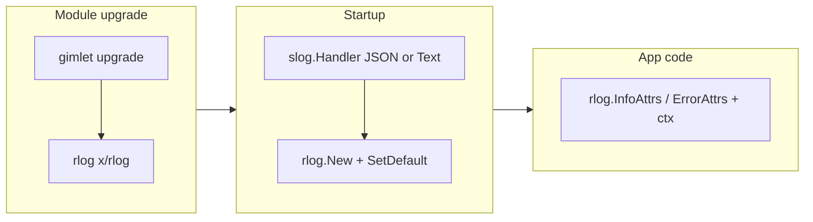

# Zerolog → rlog migration plan

## Why gimlet must move first

`[go.mod](go.mod)` lists both `github.com/rs/zerolog` and `go.rtnl.ai/gimlet@v1.5.0`. `go mod graph` shows **gimlet v1.5.0 depends on zerolog**. Even if this repo drops its direct zerolog require, **zerolog would remain indirect** until gimlet is upgraded. Per `[.cursor/zerolog-to-rlog-lessons-for-agents.md](.cursor/zerolog-to-rlog-lessons-for-agents.md)` §2, **bump gimlet and rlog in one change** and fix compile errors together.

**Pinned versions for this migration:**

- `**go.rtnl.ai/gimlet` v1.6.1** — logging middleware and helpers aligned with slog/rlog.
- `**go.rtnl.ai/x` v1.12.1**— provides `**go.rtnl.ai/x/rlog`** at the desired release (import path `go.rtnl.ai/x/rlog`, module `go.rtnl.ai/x`).

Run `**go mod tidy`**and `**go mod why -m github.com/rs/zerolog`** until zerolog is gone (direct and indirect), unless another dependency still pulls it.

## Current surface area (this repo)

| Area                                           | Role today                                                                                                                                                                                                                              |
| ---------------------------------------------- | --------------------------------------------------------------------------------------------------------------------------------------------------------------------------------------------------------------------------------------- |
| `[pkg/server/server.go](pkg/server/server.go)` | `init`: GCP field names, `logger.SeverityHook`, JSON stdout default; `New`: `SetGlobalLevel`, optional `ConsoleWriter`                                                                                                                  |
| `[pkg/config/config.go](pkg/config/config.go)` | `LogLevel` as `logger.LevelDecoder`; `GetLogLevel() zerolog.Level`                                                                                                                                                                      |
| `[pkg/server/status.go](pkg/server/status.go)` | `c.Set(logger.LogLevelKey, zerolog.DebugLevel)` for quieter probe routes                                                                                                                                                                |
| Call sites using `github.com/rs/zerolog/log`   | `[pkg/server/openapi.go](pkg/server/openapi.go)`, `[auth.go](pkg/server/auth.go)`, `[pages.go](pkg/server/pages.go)`, `[users.go](pkg/server/users.go)`, `[pkg/web/web.go](pkg/web/web.go)`, `[pkg/auth/issuer.go](pkg/auth/issuer.go)` |
| Tests                                          | `[pkg/config/config_test.go](pkg/config/config_test.go)` (zerolog levels in assertions and `LevelDecoder(...)` fixtures)                                                                                                                |

**Out of scope for zerolog removal:** `[cmd/quarterdeck/main.go](cmd/quarterdeck/main.go)` and `[cmd/bosun/main.go](cmd/bosun/main.go)` use **stdlib** `log` for CLI fatals—not zerolog.

**Telemetry:** `[pkg/telemetry](pkg/telemetry)` sets an OTEL `LoggerProvider` but the app’s request logging today is **stdout zerolog**, not `otelslog`. For the minimal migration, keep **one root sink** (stdout JSON or text) via rlog as in the guide §5; treat **stdout + OTEL log export** (guide §8: `rlog.NewFanOut` / `slog.NewMultiHandler`) as an optional follow-up once you confirm `LoggerProvider` wiring order.

## Implementation sequence

### 1. Dependencies

- Remove `**github.com/rs/zerolog`** from `[go.mod](go.mod)`.
- Add `**go.rtnl.ai/x/rlog`** (target v1.12.x per guide).
- Upgrade `**go.rtnl.ai/gimlet`**to a version compatible with that rlog (and adjust `**go.rtnl.ai/x`** if the resolver demands it).
- Align OTEL **log** modules if you introduce `**otelslog`** in the same PR (guide §2); if not, skip and keep a single handler.

### 2. Config and levels (guide §3)

- Change `[Config.GetLogLevel](pkg/config/config.go)` to return `**slog.Level`** (or delegate to whatever the upgraded gimlet `LevelDecoder` exposes—e.g. `rlog.LevelDecoder` if that is the new pattern).
- Update `[pkg/config/config_test.go](pkg/config/config_test.go)`: compare to `**slog.LevelError`**, `**slog.LevelInfo`**, `**slog.LevelDebug**` (trace mapping as documented for the new decoder)—**not** `zerolog.*` or fragile `.String()` comparisons.

### 3. Root logger at startup (guide §5, §12 “silent startup”)

Replace `[pkg/server/server.go](pkg/server/server.go)` `init` + `New` logic:

- Build an `**slog.Handler`**:
  - **JSON / GCP-shaped output:** use `slog.NewJSONHandler` with `ReplaceAttr` (or gimlet/rlog helpers if provided post-upgrade) so **time** and **message** keys match existing constants `[logger.GCPFieldKeyTime](pkg/server/server.go)` / `[logger.GCPFieldKeyMsg](pkg/server/server.go)`, and preserve **severity** behavior that `logger.SeverityHook` gave zerolog (the upgraded gimlet may ship an slog/rlog equivalent—use that rather than reimplementing).
  - **Console mode** (`ConsoleLog`): use `**slog.NewTextHandler`** (or rlog’s recommended colored console pattern) with RFC3339-style times, not `zerolog.ConsoleWriter`.
- Wrap with `**rlog.New(slog.New(handler))`**and call `**rlog.SetDefault(...)`**.
- Apply **level** via handler options using `s.conf.GetLogLevel()` instead of `zerolog.SetGlobalLevel`.
- Ensure **telemetry-disabled** paths still call `**rlog.SetDefault`** so nothing runs without a logger (guide §8 last sentence).

**Optional:** If graceful shutdown must run before exit on fatal paths, set `**rlog.SetFatalHook`** once `*Server` exists (guide §7); otherwise leave fatals as-is.

### 4. Per-request log level key (guide §10 + gimlet API)

In `[pkg/server/status.go](pkg/server/status.go)`, replace `zerolog.DebugLevel` with whatever `**logger.LogLevelKey`**expects after the gimlet upgrade (almost certainly `**slog.LevelDebug`** or an rlog-level constant). Confirm against upgraded gimlet’s `logger` package.

### 5. Mechanical call-site conversion (guide §4)

For each zerolog chain, use `**rlog.*Attrs(ctx, msg, attrs...)**` with `**slog.String**`, `**slog.Any("err", err)**`, `**slog.Int**`, `**slog.Bool**`, `**slog.Duration**`, etc.

- **Files:** `[openapi.go](pkg/server/openapi.go)`, `[server.go](pkg/server/server.go)`, `[auth.go](pkg/server/auth.go)`, `[pages.go](pkg/server/pages.go)`, `[users.go](pkg/server/users.go)`, `[pkg/web/web.go](pkg/web/web.go)`, `[pkg/auth/issuer.go](pkg/auth/issuer.go)`.
- **Context:** In Gin handlers, prefer `**c.Request.Context()`**; elsewhere `**context.Background()`** when unavoidable.
- **Derived loggers:** If any code used `log.With()`, use `**rlog.With`**/ `***rlog.Logger.With`**—not `**l.Logger.With**` only (guide §6).

**Naming collision:** Drop the zerolog `log` import; import rlog as `rlog` (or keep local name consistent across packages).

### 6. Tests (guide §9)

- Prefer `**rlog.NewCapturingTestHandler`** and helpers for any new logging assertions.
- Re-run `**go test ./...`** (guide §12: build-only is insufficient).

### 7. Verification checklist

- `**go test ./...`** green.
- `**go mod why -m github.com/rs/zerolog`** shows no requirement (or only acceptable indirect from unmigrated deps).
- Spot-check JSON output in default mode: time/message/severity fields still suitable for GCP if that was the intent.

### 8. Git workflow

- **Commit** the migration to the **working branch** when tests and tidy are green.
- **Do not open a PR** for this change as part of the plan; treat that as out of scope unless someone explicitly requests it later.

